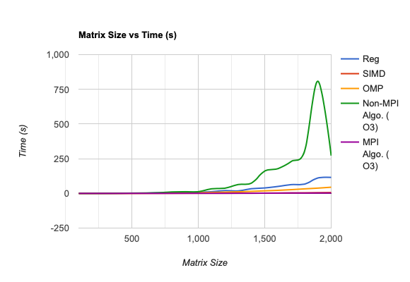
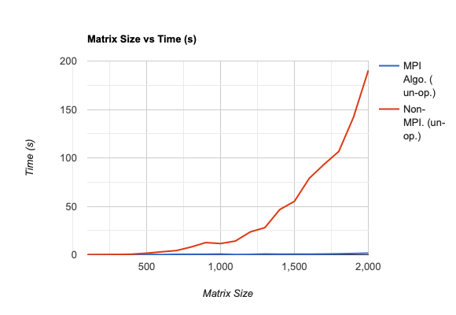

Mark Heimann, Stephen Lucas, Aaron Liu
Lab 6 Parallel Computing

1. We using a loop as the argument for main function that start with the matrix size of 100 to 2000, each loop will increase the size by 100. Also, we create a file to store the data for the time needs to do the multiplication for two matrixes and the size of the matrixes. For the master, we broadcast the second matrix and then store the rows of the first matrix to buffer, then send the buffer to the slave to do the calculation then send the answer back to the master. Then write the times to the file. For the slave, we broadcast the second matrix, then loop throught the receive method to get the buffer still the end. Then, use omp method to calculate the answer, then use the send method to send the answer back to the master. Then, we close the file and finalize the MPI.

2.
Contributions:
Mark completed the day one task of running matrix multiplication non-vectorized in C as well as creating a vectorized version.
Mark also completed the Matrix multiplication parallelization in Java.

Aaron
implement the mpi_omp method and the modify the omp_timing file, so it doesn't need to take any argument in the comman line, it will automatically loop from matrix size of 100 to 2000. Also, I made it to output the data to the text file for  the purpose of generating the graph.

Stephen

When wanting to review each other's work we would voice chat and screenshare, so we could see exactly what was happening with the changes being made.

We used a project board on Trello. We used it to keep track of everything required for the project and delegate work to the group. It also helped us keep track of what deliverables we have completed. To test we looped through a range of matrix sizes (100-2000) and collected data on exectution time of our different algorithms. We did consider the code from the professor might have flaws, and we did end up modifying it. We wrote code in our methods to generate random matricies of different sizes. This is implemented in our code successfully.We planned the work needed to generate graphs. We automated the data collection, not the graphing.

It took much planning and testing for our developed algorithms, and it took a fair amount of time writing the algorithms. Overall, more time was spent planning, testing, and debugging compared to the actual writing of code. The typical cycle of :write, compile, run, test code was thrown off a bit with this project. Requiring development to be on Wolfgand cluster through off our typical coding environment, so we were forced to adapt.
3.
The typical cycle of :write, compile, run, test code was thrown off a bit with this project.  Requiring development to be on Wolfgand cluster through off our
typical coding environment, so we were forced to adapt.

